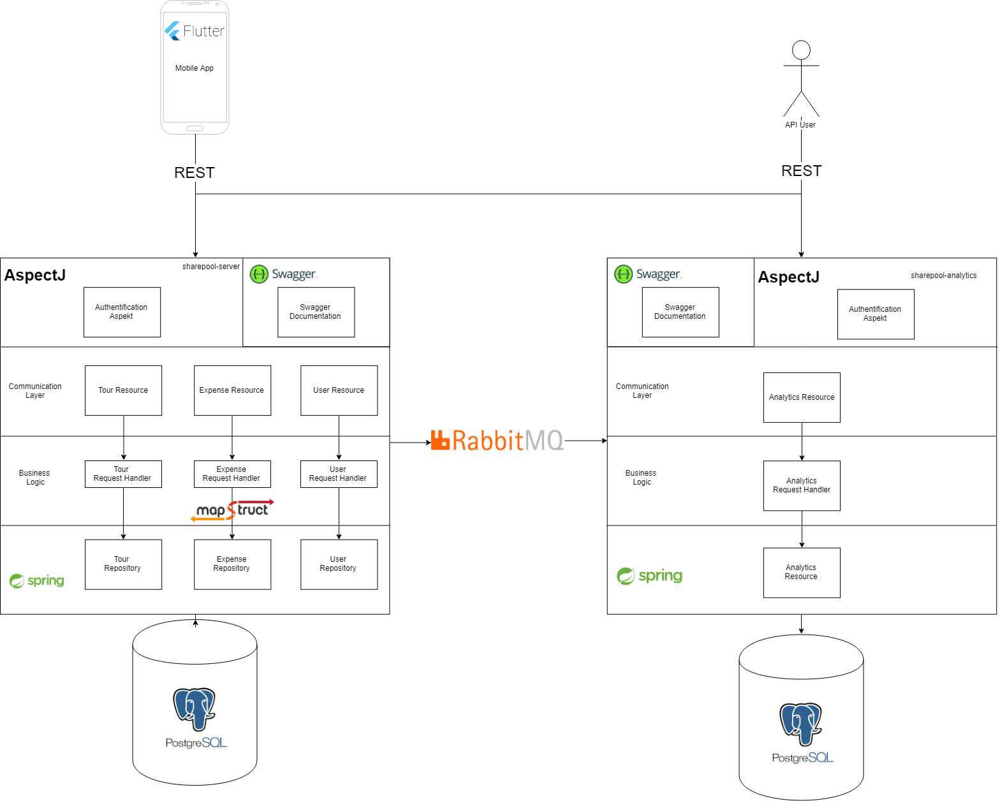

# SharePool Server
&copy; Tobias Kaderle & Jan Wiesbauer

## Description
This project provides the backend for the `SharePool-Mobileapp`. SharePool is an application to simplify forming and maintaining carpooling communities. The complete vision for the application can be read in the [Proposal](PROPOSAL.md).

## Technology- and Architecturestack
The server-project consists of 2 microservices: `sharepool-server` and `sharepool-analytics`. API-users can communicate with these via `REST`. Internally, `AMQP` or its reference implementation `RabbitMQ` is used for information exchange. Both microservices use the `Spring-Framework` to provide their services. Internally the many possibilities of Spring are used in combination with other compatible frameworks.

The following diagram shows the architecture structure as well as the used technologies of the server in detail.

The product can be used both by the mobile application and by the end user as an API.

Spring represents the core framework. It provides opportunities to provide the resources and connect them to the business logic. Business logic also uses the `MapStruct` framework, which provides code generation for converting between communication layer DTOs and domain classes. This eliminates the need to write boiler plate code.

Via `RabbitMQ` information is transmitted from the server to the analytics service. The server prepares this information and provides the user with statistical information.

`PostgreSQL` is used as the database, as it is convincing in terms of functionality and scalability. Each individual microservice receives its own instance, which decouples it.

The entire infrastructure, i.e. both PostgreSQL instances and the `RabbitMQ` server, are provided via `Docker`.

## Server Service
### REST-Interface
The entire REST layer is documented using Swagger2 or OpenApi. This documentation is provided individually by both services. At this point reference is made to the following documentation:

* Local: [sharepool-server](localhost:8080/swagger-ui.html) and [sharepool-analytics](localhost:8081/swagger-ui.html)
* Remote: [sharepool-server](http://geanik.ddns.net:8080/swagger-ui.html) and [sharepool-analytics](http://geanik.ddns.net:8081/swagger-ui.html)

The REST interface also corresponds to the highest degree of maturity of the `Rest Maturity Model`, since the concept of `HATEOAS` is applied in addition to the conventional requirements. This enables a better decoupling of server and client, since e.g. URLs of resources can be easily changed without breaking integrations.

## Analytics Service
Another point we wanted to offer in our app is the view of statistics and analysis data. Basically the user should see how many trips they have made and how much fuel has been saved by driving together. Since this functionality can be easily decoupled from the main functionalities (tour management, booking, ...), we moved it to another micro service.

The service is also implemented with Spring-Boot, and receives information about new booked trips via RabbitMQ. We decided to use RabbitMQ, because there is no blockage if the `Analytics Service` does not follow up with the processing when using the `Server Service` at high frequency. The messages simply accumulate in the broker and are then processed bit by bit.

A user can then query his analysis data via the frontend. Since these are to be displayed summed up for each day, this transformation is carried out directly on the server. So a `map` with date as key is sent to the frontend, which has as values the sums of the journeys and the saved fuel. This way the data can be displayed directly in the UI without having to be converted large.
